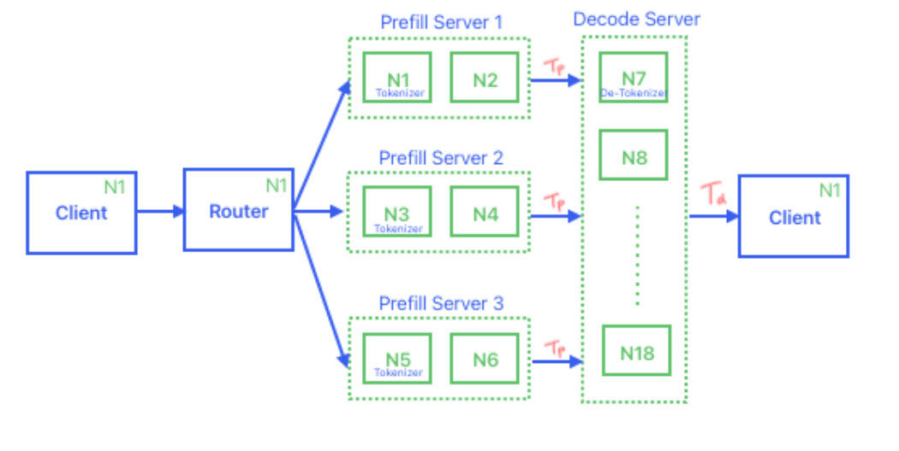

# 确定各种Sever的Node序号

每组Prefill使用2个node，总共启动1~3组prefill。当前脚本启动了1组prefill。

每组Decode使用12个node。

Router和Client都运行在第一个node上。

这里的Client就是Benchmark。



# 执行步骤

所有的指令都是先登录到第一个节点，再执行。

有时候还需要进入到docker再运行。

## 申请资源
```
bash 1.salloc.sh
```

## 确定各种Server使用的node list

在申请资源的界面上执行：
```
bash 2.get_node_list_env.sh
```

运行上面的命令会生成 node_list_env.sh，在后面启动server的脚本中会用到。

## 启动Prefill Server

```
3.launch_prefill_server.sh
```
## 启动Decode Server

```
4.launch_decode_server.sh 
```

## 启动Router

```
# 进入docker
bash enter_first_container.sh
# 启动router
bash 5.launch_router.sh
```

## 往decoder发送slow_down 180

```
# 进入docker
bash enter_first_container.sh
# Decoder接收到这个指令之后会在每次 run_batch() 都会先 sleep 180s 在执行model forward。
bash 6.slow_down_decoder_180.sh
```

## 启动Benchmark

```
# 进入docker
bash enter_first_container.sh
# 启动router
bash 7.start_benchmark.sh
```


## 观察decoder的输出

执行了slow down 180s之后，会让 decode 每次 run_batch() 都sleep，所以prefill生成的kv cache会积累得越来越多。

decode run_batch() 也就能拿到更多的running-req并行执行。

假设启动decode的时候设置的参数是 max_running_requests=36864，dp_size=48。

running-req最大会达到 max_running_requests/dp_size = 36864/48 = 768

观察decode的打印，等到 running-req 增大到768之后执行下一条指令，也就是 slow_down null，让decode恢复正常，不再sleep。

下面是DP0的 running-req 变化情况。
```
[2025-10-16 18:59:59 DP0 TP0 EP0] Scheduler.run_batch sleep 180.0s
[2025-10-16 19:02:59 DP0 TP0 EP0] Decode batch. #running-req: 68, #token: 1201280, token usage: 0.69, pre-allocated usage: 0.63, #retracted-req: 0, cuda graph: True, gen throughput (token/s): 0.38, #queue-req: 0,
[2025-10-16 19:02:59 DP0 TP0 EP0] Decode batch. #running-req: 68, #token: 1201280, token usage: 0.69, pre-allocated usage: 0.49, #retracted-req: 0, cuda graph: True, gen throughput (token/s): 305.75, #queue-req: 0,
[2025-10-16 19:02:59 DP0 TP0 EP0] Scheduler.run_batch sleep 180.0s
[2025-10-16 19:06:00 DP0 TP0 EP0] Decode batch. #running-req: 303, #token: 1231488, token usage: 0.71, pre-allocated usage: 0.35, #retracted-req: 0, cuda graph: True, gen throughput (token/s): 1.68, #queue-req: 0,
[2025-10-16 19:06:01 DP0 TP0 EP0] Scheduler.run_batch sleep 180.0s
[2025-10-16 19:09:01 DP0 TP0 EP0] Decode batch. #running-req: 540, #token: 1261952, token usage: 0.72, pre-allocated usage: 0.21, #retracted-req: 0, cuda graph: True, gen throughput (token/s): 2.97, #queue-req: 5,
[2025-10-16 19:09:01 DP0 TP0 EP0] Scheduler.run_batch sleep 180.0s
[2025-10-16 19:12:01 DP0 TP0 EP0] Scheduler.run_batch sleep 180.0s
[2025-10-16 19:15:01 DP0 TP0 EP0] Decode batch. #running-req: 768, #token: 1291136, token usage: 0.74, pre-allocated usage: 0.07, #retracted-req: 0, cuda graph: True, gen throughput (token/s): 2.13, #queue-req: 250,
[2025-10-16 19:15:02 DP0 TP0 EP0] Scheduler.run_batch sleep 180.0s
[2025-10-16 19:18:02 DP0 TP0 EP0] Decode batch. #running-req: 768, #token: 1291136, token usage: 0.74, pre-allocated usage: 0.00, #retracted-req: 0, cuda graph: True, gen throughput (token/s): 4.26, #queue-req: 368,
[2025-10-16 19:18:02 DP0 TP0 EP0] Scheduler.run_batch sleep 180.0s
```


## 往decoder发送slow_down null

```
# 进入docker
bash enter_first_container.sh
# Decoder接收到这个指令之后会结束每次前向之前的sleep.
bash 8.slow_down_decoder_null.sh
```
发送这条指令之后，需要等180s左右，decode才会有反馈。

## 抓取Torch Profile

等到Decode响应了上一条指令之后，表明decode已经不再sleep，进入到正常的decode阶段，就可以用下面的指令抓取profile了。

可以反复执行多次，获得不同时刻的profile信息。

脚本里面写的是每次保存5个step的profile信息。

```
# 进入docker
bash enter_first_container.sh
# 抓取profile
bash 9.sglang_profile.sh
```

# load balance between ep ranks

In order to make load balance between ep ranks, there two solutions:

## solution-1: using pre dumped expert distribution file to init expert location.
GB200 blog2 use this solution.

### step 1. create expert distribution data

lauching decode server with `--expert-distribution-recorder-mode` stat and `--expert-distribution-recorder-buffer-size -1` .

before start benchmark, start expert distribution recode with `bash enter_first_container.sh; bash z.1.start_record.sh`.

wait 30 minutes after executing `bash 7.slowdown_decoder_null.sh`, then dump expert distribution recode with `bash enter_first_container.sh; bash z.2.dump_record.sh`.
The dumped file will be saved in `${SGLANG_EXPERT_DISTRIBUTION_RECORDER_DIR}`.

For more informanntion, please refer to [Deploying DeepSeek with PD Disaggregation and Large-Scale Expert Parallelism on 96 H100 GPUs | LMSYS Org](https://lmsys.org/blog/2025-05-05-large-scale-ep/)

### step 2. using `--init-expert-location` to indicate pre dumped expert distribution file

lauching decode server with `--init-expert-location ${SGLANG_EXPERT_DISTRIBUTION_RECORDER_DIR}/expert_distribution_recorder_xxx.pt`


## solution-2: using `--eplb-algorithm deepseek` and `--enable-eplb` flags to run real time load rebalance.

Lauching decode server with `--eplb-algorithm` deepseek and `--enable-eplb` flags. The eplb manager to do some work in order to make load balance. This step will need extra gpu memory。


# calculate throughput

Here is an example of throughput calculation. You can follow this example to calculate the throughput for ep48.

### Global Batch Size
Search "Profiling starts" and "Stop profiling" in "logs/launch_server_decode_node_rank_0.log", 
We can find some logs like the following line, and "1760576844.4826152" indicate the filename of torch profile.
```
[2025-10-15 18:07:24 DP0 TP0 EP0] Profiling starts. Traces will be saved to: /lustre/fs1/portfolios/coreai/projects/coreai_devtech_all/users/shifangx/1.workspace/6.SGLang_PD/Scripts-SGLang/../torch_profiler (with profile id: 1760576844.4826152)
```

We also can find some logs like the following line, and "#running-req: 232" indicate the local batch size for DP0 is 232.
```
[2025-10-15 18:07:24 DP0 TP0 EP0] Decode batch. #running-req: 285, #token: 328960, token usage: 0.51, pre-allocated usage: 0.00, #retracted-req: 0, cuda graph: True, gen throughput (token/s): 3344.60, #queue-req: 0, 
```

Using the method above, we can find local batch size for each DP rank: 285, 256, 254, 265, 271, 227, 221, 269.
so global batch size is: 285 + 256 + 254 + 265 + 271 + 227 + 221 + 269 = 2048.

### Duation For Each Forward Step
Now open the torch profile torch_profiler/1760576844.4826152-TP-0.trace.json.gz
We can find that the duation for each forward step is 65ms.

### Throughput For Each GPU
Now we can calculate the throughput for each gpu: 2048/0.065/8 = 3938 (toks/s/gpu)


# 参考资料

## SGLang developer guide

[SGLang developer guide: bench_serving](https://docs.sglang.io/developer_guide/bench_serving.html#bench-serving-guide)

## SGLang的系列博客

[Deploying DeepSeek with PD Disaggregation and Large-Scale Expert Parallelism on 96 H100 GPUs | LMSYS Org](https://lmsys.org/blog/2025-05-05-large-scale-ep/)

[Deploying DeepSeek on GB200 NVL72 with PD and Large Scale EP (Part I): 2.7x Higher Decoding Throughput | LMSYS Org](https://lmsys.org/blog/2025-06-16-gb200-part-1/)

[Deploying DeepSeek on GB200 NVL72 with PD and Large Scale EP (Part II): 3.8x Prefill, 4.8x Decode Throughput | LMSYS Org](https://lmsys.org/blog/2025-09-25-gb200-part-2/)

[Together with SGLang: Best Practices for Serving DeepSeek-R1 on H20-96G | LMSYS Org](https://lmsys.org/blog/2025-09-26-sglang-ant-group/)


## DeepSeek V3模型简单示例

SGLang的这个pr里面有B200 TP8并行的脚本和执行结果。
可以作为搭建GB200 EP8的参考示例。

[Enables TRT-LLM backend to be used for target_verify by pranavm-nvidia · Pull Request #10281 · sgl-project/sglang](https://github.com/sgl-project/sglang/pull/10281)


## SGLang code walk through

[Awesome-ML-SYS-Tutorial/sglang/code-walk-through](https://github.com/zhaochenyang20/Awesome-ML-SYS-Tutorial/tree/main/sglang/code-walk-through)

## FlashInfer论文

flashinfer 作为sglang的后端，从中可以了解一些底层的设计思路。

[FlashInfer: Efficient and Customizable Attention Engine for LLM Inference Serving](https://arxiv.org/abs/2501.01005)

